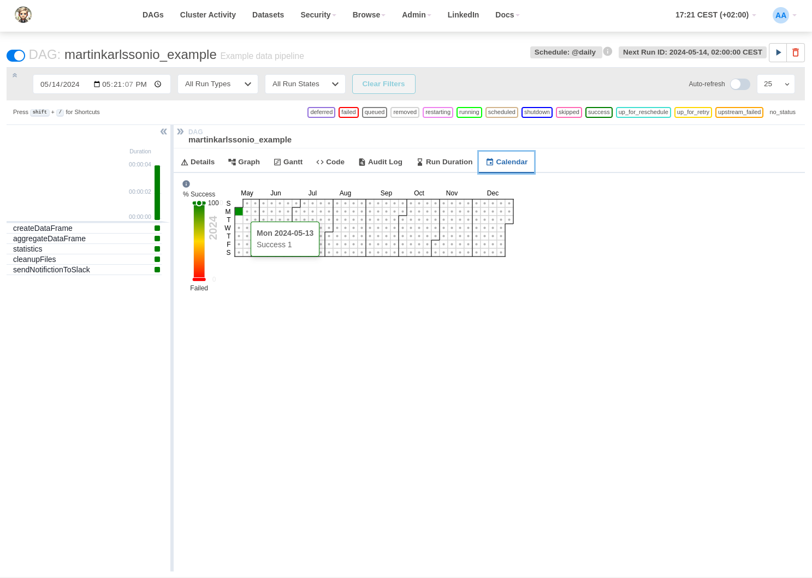

# Data Pipelines with Airflow
## Example of Data Pipelines infrastructure

<!--
*** Written by Martin Karlsson
*** www.martinkarlsson.io
-->

[![LinkedIn][linkedin-shield]][linkedin-url]
<!-- ABOUT THE PROJECT -->
## About The Project
<br>
Intention with this project is to provide a boilerplate for a Data Pipeline infrastructure using Apache Airflow. The project is intended to be used as a starting point for a more complex data pipeline infrastructure.
<br>
# DAGs
The repository contains one example DAG that will create a mocked Polars dataframe and perform various tasks on the data.
It uses xComs to pass information between tasks and uses the PythonOperator to run Python functions. The data is stored as parquet files during the DAG run.
<br>





# FAQ

### Pre-requisite
You need to have Docker and Docker-Compose installed on your machine.

### How to start the project
```python __main__.py```

### Permission error
Ensure that he folders (config, dags, logs, plugins) have the right permissions
```bash chmod -R 777 config dags logs plugins```

<!-- CONTACT -->

## Contact

### Martin Karlsson

LinkedIn : [martin-karlsson][linkedin-url] \
Twitter : [@HelloKarlsson](https://twitter.com/HelloKarlsson) \
Email : hello@martinkarlsson.io \
Webpage : [www.martinkarlsson.io](https://www.martinkarlsson.io)


Project Link: [github.com/martinkarlssonio/apache-airflow](https://github.com/martinkarlssonio/apache-airflow)


<!-- MARKDOWN LINKS & IMAGES -->
[linkedin-shield]: https://img.shields.io/badge/-LinkedIn-black.svg?style=for-the-badge&logo=linkedin&colorB=555
[linkedin-url]: https://linkedin.com/in/martin-karlsson

